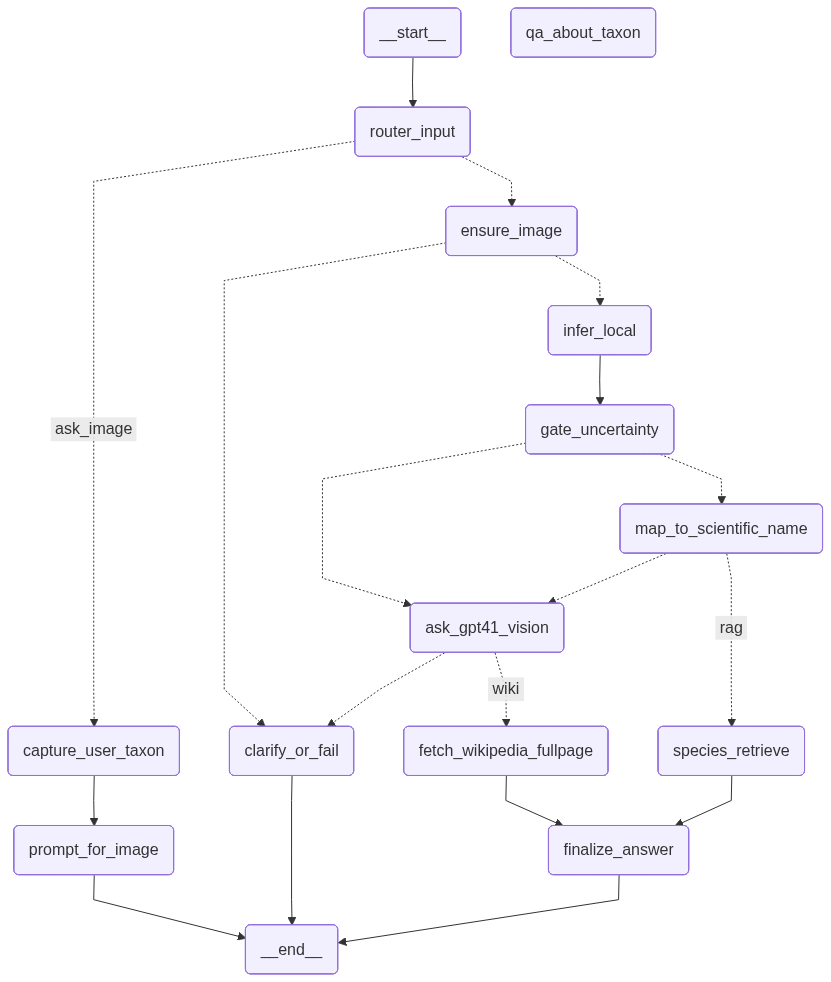

---
title: MonoAgent
emoji: 🐵
colorFrom: indigo
colorTo: purple
sdk: gradio
sdk_version: "5.42.0"
app_file: app.py
pinned: false
-------------

# MonoAgent — Intelligent Primate Agent with LangGraph + Gradio

**MonoAgent** is a personal research project designed to showcase how machine learning, retrieval, and multimodal reasoning can be orchestrated into a unified intelligent agent. Built with **LangGraph** and deployed with **Gradio**, it demonstrates how to create a transparent, traceable, and explainable pipeline that integrates computer vision, large language models, and external knowledge bases.

* **GitHub Repository:** [https://github.com/juanbarearojo/monoagent-langgraph](https://github.com/juanbarearojo/monoagent-langgraph)
* **Hugging Face Space:** [https://huggingface.co/spaces/Barearojojuan/MonoAgent](https://huggingface.co/spaces/Barearojojuan/MonoAgent)

## Why MonoAgent?

* 🧠 **Hybrid Reasoning** → Combines a local deep learning classifier with external retrieval (Wikipedia + FAISS RAG) and GPT-4 Vision for robust out-of-distribution handling.
* 🔎 **Transparency & Traceability** → Integrated with **Langfuse** for observability and experiment tracking, making every step in the pipeline auditable.
* 🕸 **Graph-based Orchestration** → Fully powered by **LangGraph**, ensuring modularity, extensibility, and clear visualization of the workflow.
* 📚 **Knowledge-Enriched Answers** → Goes beyond simple classification, providing scientifically grounded, contextual responses.
* 🚀 **Portable & Presentable** → Clean **Gradio** interface, accessible locally or on Hugging Face Spaces.

## Agent Architecture

The agent is orchestrated through a **LangGraph computation graph**. Each node represents a functional step, and the conversation state flows between them under policies defined in `agent/state.py` and `agent/policies.py`.

<p align="center">
  
</p>

### Core Nodes

* **router\_input (`agent/nodes/router.py`)** → Routes initial input (image or text).
* **ensure\_image (`agent/nodes/ensure_image.py`)** → Validates image presence or prompts the user.
* **infer\_local (`agent/nodes/infer_local.py`)** → Runs the TorchScript primate classifier (`model/monkey_classifier_ts-v0.1.pt`).
* **gate\_uncertainty (`agent/nodes/gate_uncertainty.py`)** → Evaluates classifier confidence; low-confidence predictions are redirected to GPT-4 Vision.
* **map\_to\_scientific\_name (`agent/nodes/map_scientific.py`)** → Maps internal classifier labels to canonical scientific names.
* **ask\_gpt41\_vision (`agent/nodes/ask_gpt41_vision.py`)** → Multimodal LLM for out-of-distribution cases.
* **species\_retrieve (`agent/nodes/species_retrieve.py`)** → Retrieves semantically relevant documents from FAISS indices (`indices/global/`).
* **fetch\_wikipedia\_fullpage (`agent/nodes/wiki_fullpage.py`)** → Fetches and processes complete Wikipedia pages.
* **merge\_context (`agent/nodes/merge_context.py`)** → Merges Wikipedia and RAG context.
* **finalize (`agent/nodes/finalize.py`)** → Generates the final enriched answer.
* **qa\_about\_taxon (`agent/nodes/qa_about_taxon.py`)** → Handles user queries about identified taxa.
* **clarify / prompt\_for\_image (`agent/nodes/clarify.py`, `agent/nodes/prompt_for_image.py`)** → Resolves missing or ambiguous inputs.
* **capture\_user\_taxon (`agent/nodes/capture_user_taxon.py`)** → Allows manual input of taxon names.

### Tools (`agent/tools/`)

* **wiki.py** → Wikipedia article fetcher.
* **vision.py** → Vision model utilities.
* **gpt.py** → GPT connectors.
* **rag\_index.py** → FAISS-based semantic indexing and retrieval.

### Utilities (`agent/utils/`)

* **images.py** → Image processing and conversion.
* **text.py** → Text normalization and validation.

## Workflow

1. User submits an image or a question.
2. Input is validated and routed to the appropriate path.
3. Local classifier attempts prediction.
4. Confidence is checked; low-confidence results invoke GPT-4 Vision.
5. Prediction is mapped to a scientific name.
6. Wikipedia and FAISS retrieval provide external context.
7. Information is merged into a coherent, traceable answer.
8. The agent responds, or asks the user for clarification when needed.

## Project Structure

```
app.py
requirements.txt
model/
 ├─ monkey_classifier_ts-v0.1.pt
 └─ labels.json
grafo.png   # visual diagram of the agent
```

## Running Locally

```bash
pip install -r requirements.txt
python app.py
```

## Deployment Notes

* CI/CD mirrors the project to Hugging Face Spaces.
* Large files (`.pt`, `.faiss`, PDFs in `data/corpus/`) should be managed with **Git LFS**.
* **Langfuse integration** ensures experiment tracking, debugging, and transparency.

## License

MIT
